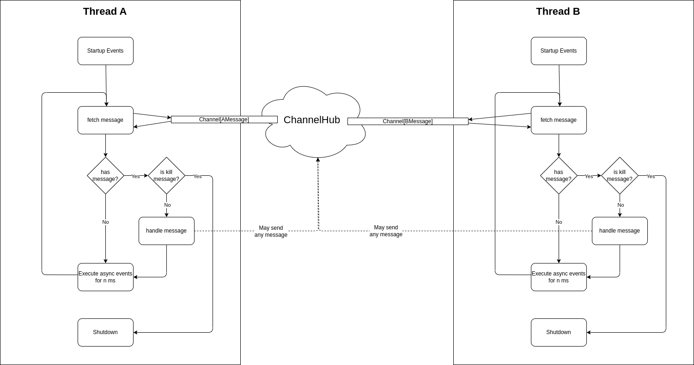
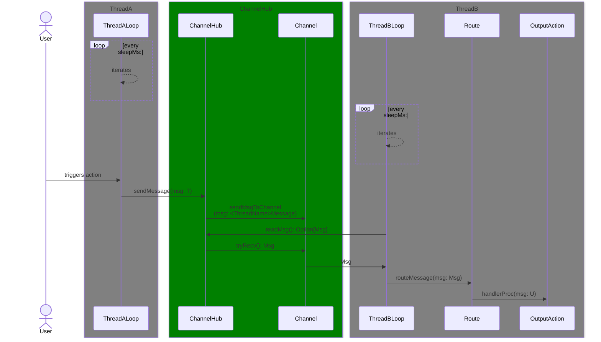

# ThreadButler

| :exclamation:  This library is currently in an alpha version. Testing as of right now consists of compiling and manually testing the examples.   |
|-----------------------------------------|

#### _They're here to serve_
**ThreadButler** is a package for multithreading in applications. 

It simplifies setting up "threadServers" - threads that live as long as your application does and can be pinged with messages and send messages to any other thread themselves. 

They act as a "backend" for any heavy computation you do not wish to perform in your client loop. 

The message sending is enabled via nim's [Channels](https://nim-by-example.github.io/channels/). ThreadButler defines a shared ChannelHub that contains 1 Channel for each Thread. Those channels accept only messages for the Thread they're assigned to.

- [Documentation](https://philippmdoerner.github.io/ThreadButler/bookCompiled/index.html) (built with [nimibook](https://github.com/pietroppeter/nimibook))
- [Index](https://philippmdoerner.github.io/ThreadButler/htmldocs/theindex.html)
- [RootModule](https://philippmdoerner.github.io/ThreadButler/htmldocs/threadButler.html)

## Installation # PACKAGE NOT YET INSTALLABLE #

Install ThreadButler with Nimble:

    $ nimble install -y threadButler

Add ThreadButler to your .nimble file:

    requires "threadButler"

## Provided/Supported:
- Defining and spawning long-running threads with threadServers that receive and send messages 
- Typesafe message passing - A message will always be sent to the correct thread it belongs to, as determined by its type
- Async message handlers
- Running procs as tasks on a threadPool which can message results back if necessary without ever blocking
- Customizable ServerLoops
- Kill-Thread mechanisms
- Startup/Shutdown events per Thread

## General Architecture

The following statements describe the architecture behind threadButler:
- All Channels are combined into a single hub, the ChannelHub, which is accessible by all threads.
- Each Thread has its own name `<ThreadName>`through which things are associated with it and names of data-types etc. related to it are inferred.
- Each Thread has 1 enum `<ThreadName>Kinds` covering all kinds of messages that can be sent through its Channel
- Each Thread has 1 Object Variant wrapping any kind of message that can be sent to a Thread
- Each Thread has 1 Channel associated with it through which its associated object variant can be sent.
- Each Object Variant has the name `<ThreadName>Message` suffix
- Each Thread has its own mainloop.
- Each Thread has its own routing proc `routeMessage` which "unpacks" the object variant to a message and calls the handler-proc of the appropriate route.
- Each Thread has its own set of message-types it can receive and handler-procs for handling those message-types associated with it.
- When a message of a message type T gets sent to a Thread, it get wrapped in the object variant associated with the Thread that T is registered with, then sent through their associated Channel on the ChannelHub

### General Flow of Actions

### Sequence Diagram
A sequence diagram of the actions that happen to send a single message from thread A to thread B.

## Special Integrations
ThreadButler provides small, simple utilities for easier integration with specific frameworks/libraries.

Currently the following packages/frameworks have such modules: 

- [Owlkettle](https://philippmdoerner.github.io/ThreadButler/htmldocs/threadButler/integrations/owlButler.html)

## Limitations
#### Must use -d:useMalloc
Due to memory issues that occurred while running some stress-tests it is currently discouraged to use nim's default memory allocator. Use malloc with `-d:useMalloc` instead.

See [nim-lang issue#22510](https://github.com/nim-lang/Nim/issues/22510) for more context.

#### Using ref type messages with -d:butlerThreading is not supported by the framework
threading/channels require a message be isolateable.
This is not easily doable as ref-types by their nature can not be isolated, as you - the user - will still be holding on to references when passing the message.

So to send a message we would need to:
- dereference the message to make it isolateable
- send it through the threading/channel
- put the message behind a reference again on the other thread

Just so the handler-proc can be called with the appropriate type again.

This requires derefferencing the message before sending and moving the message into a reference again after sending but before invoking a registered handler. The added complexity does not seem worth it.